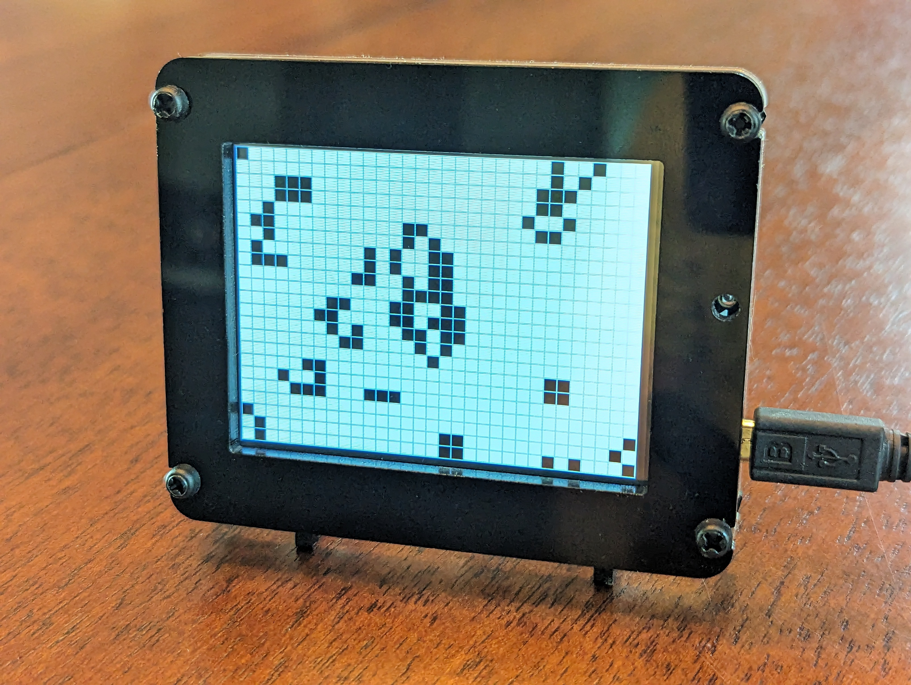

# pyportal-game-life
This project contains an Arduino sketch that builds and displays a touch-enabled version of [Conway's Game of Life](https://en.wikipedia.org/wiki/Conway%27s_Game_of_Life) on an Adafruit PyPortal. 

Read a full build tutorial for this project on [Hackster.io](https://www.hackster.io/rhammell/pyportal-conway-s-game-of-life-039294).

## Project Description

  

Conway's Game of Life is a popular mathematical simulation that takes place on a 2D grid composed of cells that are either "live" or "dead". During each game round, or "generation", rules are applied which determine if each cell lives or dies in the next round. 

This process repeats indefinitely, with each new generation building on the last, resulting in a visual representation of a dynamically evolving ecosystem. Users can observe complex shapes and patterns of live cells naturally emerge as the game progresses.

The game is implemented on a PyPortal through this project's Arduino sketch. The sketch is responsible for storing the cell states, applying the rules of the game, and displaying and updated grid on the PyPortal screen. 

Additionally, users can interact with the game by touching any cell on the PyPortal screen to change its state to live. Touch events are captured and processed by the sketch to update the selected cell.
